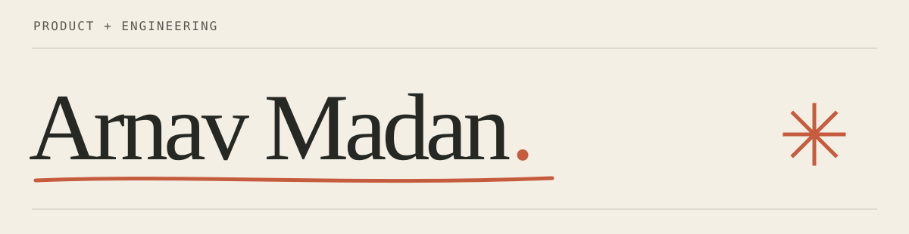

  

[Websauce](https://websauce.in) &nbsp; / &nbsp; [LinkedIn](https://www.linkedin.com/in/arnavmadan1/) &nbsp; / &nbsp; [Outside work](https://www.instagram.com/arnavmadaann/)

I’m Arnav, an AI product engineer in Chennai. I work at Vivriti Next and co-founded **Websauce**, where I work with businesses on websites, custom software and AI tools.

I like being involved before the code: talking to the person who needs something, figuring out what would help, and working through the details until it’s usable.

### Lately

**Karz Setu** — built with Aishwarya. Our project was a **Top 10 finalist in Build What Moves India with OpenAI**, from 13,000+ applications. I built the CHG-1 filing assistant: document extraction, validation and human review before form completion. [The story ↗](https://www.instagram.com/arnavmadaann/p/DdO8Z5eE0jb/)

**Websauce** — client work that starts with a business problem and ends with something people can use. Recent work includes a lighting showroom’s product discovery and enquiry journey. [Visit Websauce ↗](https://websauce.in)

### A few things you can open

| Project | What’s inside |
| :--- | :--- |
| **[Sentinel](https://github.com/madanarnav2004/qa_sentinel)** | A browser QA experiment: Jira requirements → Gemini test plans → Playwright runs → screenshot reports. Includes a local UI demo. |
| **[MaterialFlow](https://github.com/madanarnav2004/material_flow)** | A construction-materials workflow prototype covering requests, approvals, inventory and bill review. Role-based screens with local demo data. |
| **[Harbor semantic layer](https://github.com/madanarnav2004/databrain-sub)** | A take-home design exercise in business definitions, tenant isolation and safe queries. Includes SQL proofs and a walkthrough. |

### At the workbench

Python, TypeScript, React / Next.js and SQL. Lately, a lot of document workflows, LLM integrations and browser automation.

I use Codex throughout my work, including to learn unfamiliar domains and test ideas. The [Harbor AI-usage notes](https://github.com/madanarnav2004/databrain-sub/blob/main/ai-tool-usage.md) give a concrete account of what I decided and where AI helped.

Away from the laptop: motorcycle rides, trips and occasionally spending too long on a 20-second edit.
